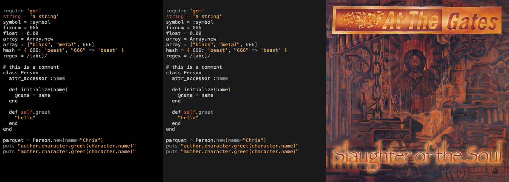
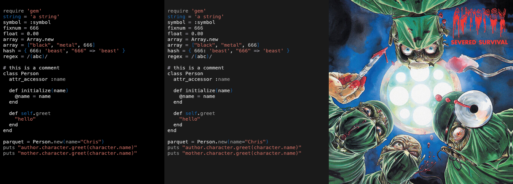
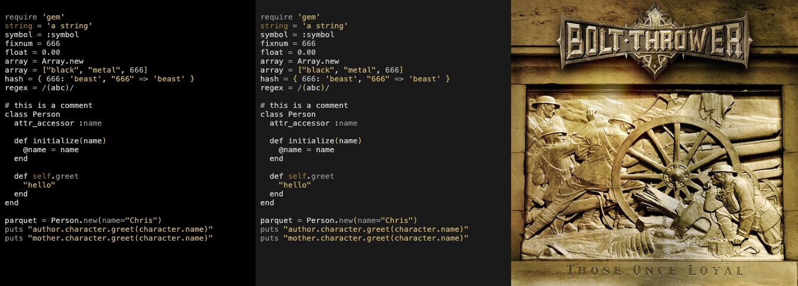
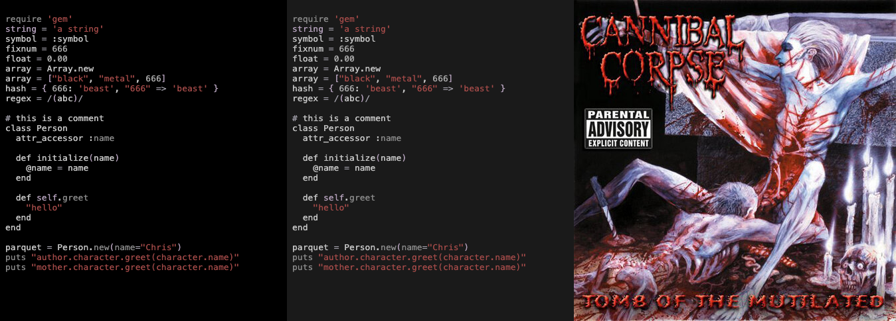
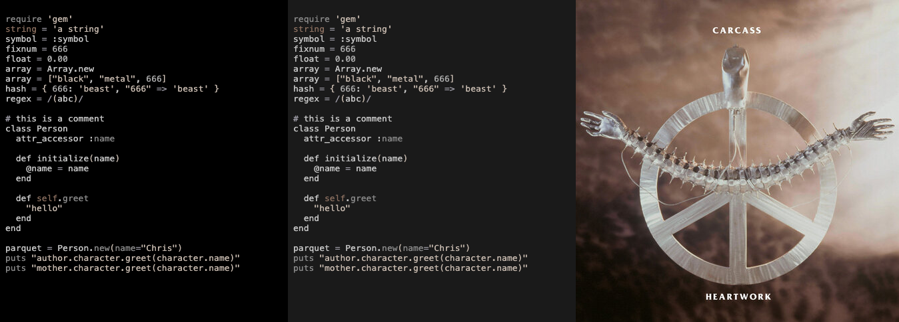
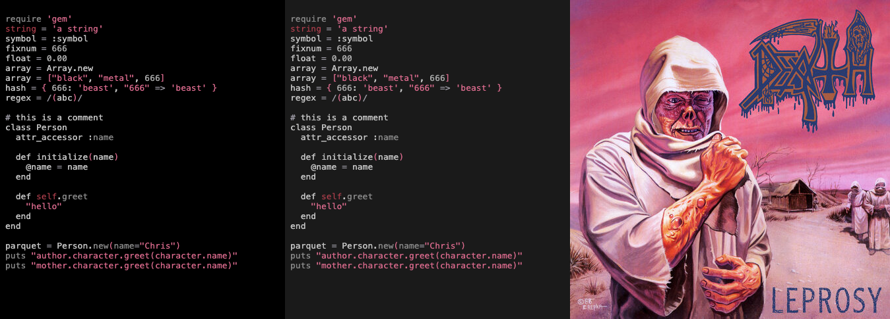
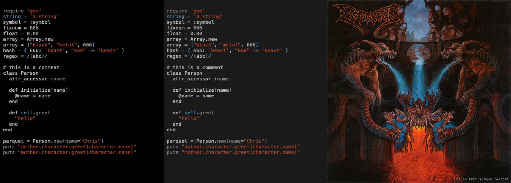
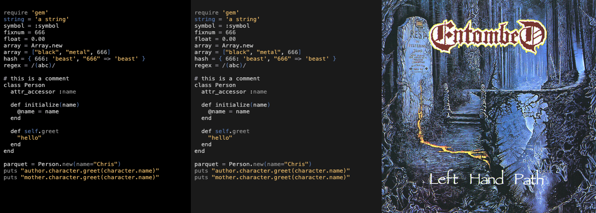
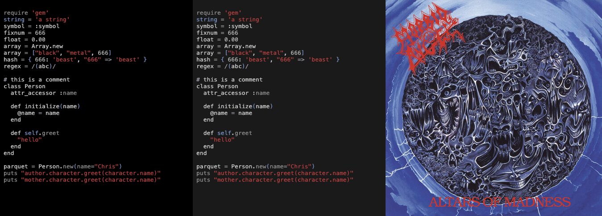

# Death Metal Neovim

A collection of death metal-inspired Neovim colorschemes!

**Sublime Text users:** Check out [death-metal-theme-sublime](https://github.com/stereoabuse/death-metal-theme-sublime) instead.

This theme collection is based on the excellent work done by [@cdmill](https://github.com/casedami) on [neomodern.nvim](https://github.com/cdmill/neomodern.nvim) and [@metalelf0](https://github.com/metalelf0) on [black-metal-theme-neovim](https://github.com/metalelf0/black-metal-theme-neovim). 🤘

## Included Themes

9 canonical death metal albums, each with default (left) and alternative (middle) variants.

### At the Gates - Slaughter of the Soul (1995)



### Autopsy - Severed Survival (1989)



### Bolt Thrower - Those Once Loyal (2005)



### Cannibal Corpse - Tomb of the Mutilated (1992)



### Carcass - Heartwork (1993)



### Death - Leprosy (1988)



### Dismember - Like an Ever Flowing Stream (1991)



### Entombed - Left Hand Path (1990)



### Morbid Angel - Altars of Madness (1989)



## Rationale

Each theme palette is extracted directly from the album artwork using color analysis. Colors are chosen to represent the album's visual aesthetic while remaining readable for code.

## Installation

With lazy.nvim:

```lua
{
  "yourusername/death-metal-theme-neovim",
  lazy = false,
  priority = 1000,
  config = function()
    require("death-metal").setup({
      -- optional configuration here
    })
    require("death-metal").load()
  end,
}
```

## Configuration

Default options:

```lua
require("death-metal").setup({
  -- Can be one of: at-the-gates | autopsy | bolt-thrower | cannibal-corpse | carcass | death | dismember | entombed | morbid-angel
  theme = "death",
  variant = "dark", -- 'light' | 'dark'
  alt_bg = false,   -- Use alternate, lighter background

  colored_docstrings = true,
  cursorline_gutter = true,
  dark_gutter = false,
  plain_float = false,
  show_eob = true,
  term_colors = true,
  toggle_variant_key = nil,
  transparent = false,

  diagnostics = {
    darker = true,
    undercurl = true,
    background = true,
  },

  code_style = {
    comments = "italic",
    conditionals = "none",
    functions = "none",
    keywords = "none",
    headings = "bold",
    operators = "none",
    keyword_return = "none",
    strings = "none",
    variables = "none",
  },

  plugin = {
    lualine = { bold = true, plain = false },
    cmp = { plain = false, reverse = false },
  },

  -- Override default colors
  colors = {},
  -- Override highlight groups
  highlights = {},
})

require("death-metal").load()
```

## Customization

Example using custom colors:

```lua
require("death-metal").setup({
  colors = {
    orange = '#ff8800',
    keyword = '#817faf',
  },
  highlights = {
    ["@keyword"] = { fg = "$keyword", fmt = 'bold' },
    ["@function"] = { bg = "$orange", fmt = 'underline,italic' },
  },
})
```

## Album References

- At the Gates: Slaughter of the Soul, 1995
- Autopsy: Severed Survival, 1989
- Bolt Thrower: Those Once Loyal, 2005
- Cannibal Corpse: Tomb of the Mutilated, 1992
- Carcass: Heartwork, 1993
- Death: Leprosy, 1988
- Dismember: Like an Ever Flowing Stream, 1991
- Entombed: Left Hand Path, 1990
- Morbid Angel: Altars of Madness, 1989

## Credits

- Original architecture: [@cdmill](https://github.com/cdmill) - [neomodern.nvim](https://github.com/cdmill/neomodern.nvim)
- Black metal themes inspiration: [@metalelf0](https://github.com/metalelf0) - [black-metal-theme-neovim](https://github.com/metalelf0/black-metal-theme-neovim)
- Death metal themes and color extraction: This repository

## License

Apache 2.0 - See LICENSE file
